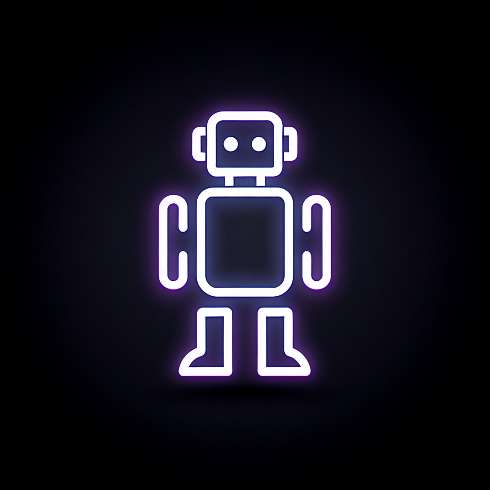

# Nemotron AI Chat

A sophisticated AI-powered chatbot application featuring NVIDIA's Llama Nemotron model with advanced cognitive augmentation capabilities, reasoning visualization, and productivity tools.



## Features

### Core Chat Capabilities
- **Multi-Model Support** - Switch between different AI models including Llama Nemotron 253B
- **Streaming Responses** - Real-time streaming of AI responses for instant feedback
- **Conversation Management** - Create, manage, and organize multiple conversations
- **Branching Conversations** - Create alternative conversation paths and explore different discussion threads
- **Bookmarks** - Save important messages for quick reference

### Reasoning & Learning Modes
- **Reasoning Mode** - Visualize the AI's step-by-step thinking process with an interactive reasoning timeline
- **Learning Mode** - Get educational explanations alongside AI responses to understand concepts better
- **Custom Reasoning Templates** - Create and use custom prompts for specialized reasoning patterns

### Cognitive Augmentation
- **Thought Extension Workspace** - Expand and develop your ideas with AI assistance
- **Idea Evolution Laboratory** - Track how ideas evolve over time with version history
- **Thought Tree Explorer** - Visualize connections between thoughts and ideas
- **Bias Detection** - Identify potential cognitive biases in reasoning

### Productivity Tools
- **Integrated Tool System** - Built-in tools for web search, weather, news, and more
- **Predictive Auto-Complete** - Context-aware suggestions as you type
- **Voice Controls** - Hands-free interaction with voice input capabilities
- **Keyboard Shortcuts** - Efficient navigation with customizable shortcuts

### User Experience
- **Beautiful Animations** - Smooth scroll-based animations and micro-interactions
- **Dark/Light Theme** - Adaptive theming with system preference detection
- **Responsive Design** - Optimized for desktop, tablet, and mobile devices
- **Accessibility** - Built with accessibility best practices

## Tech Stack

### Frontend
- **React 18** - Modern React with hooks and functional components
- **TypeScript** - Full type safety throughout the codebase
- **Tailwind CSS** - Utility-first CSS with custom theming
- **Shadcn/UI** - Beautiful, accessible component library
- **Framer Motion** - Smooth animations and transitions
- **TanStack Query** - Powerful data fetching and caching
- **Wouter** - Lightweight client-side routing

### Backend
- **Node.js** - JavaScript runtime
- **Express** - Fast, minimalist web framework
- **Drizzle ORM** - Type-safe database ORM
- **PostgreSQL** - Robust relational database (Neon-backed)
- **WebSocket** - Real-time communication support

### AI Integration
- **NVIDIA Llama Nemotron** - State-of-the-art language model
- **OpenAI API Compatible** - Standard API interface
- **Streaming Support** - Server-sent events for real-time responses

## Getting Started

### Prerequisites
- Node.js 18+ 
- PostgreSQL database (or use Replit's built-in database)
- NVIDIA API key for Llama Nemotron access

### Installation

1. Clone the repository:
```bash
git clone https://github.com/yourusername/nemotron-chat.git
cd nemotron-chat
```

2. Install dependencies:
```bash
npm install
```

3. Set up environment variables:
```bash
# Create a .env file with your API keys
NVIDIA_API_KEY=your_nvidia_api_key
DATABASE_URL=your_database_url
```

4. Push database schema:
```bash
npm run db:push
```

5. Start the development server:
```bash
npm run dev
```

The application will be available at `http://localhost:5000`

### Building for Production

```bash
npm run build
npm start
```

## Project Structure

```
├── client/                 # Frontend React application
│   ├── src/
│   │   ├── components/     # React components
│   │   │   ├── ui/         # Shadcn UI components
│   │   │   ├── ChatInterface.tsx
│   │   │   ├── WelcomeSection.tsx
│   │   │   ├── ProductivitySidebar.tsx
│   │   │   └── ...
│   │   ├── hooks/          # Custom React hooks
│   │   ├── lib/            # Utility functions
│   │   └── pages/          # Page components
├── server/                 # Backend Express server
│   ├── index.ts            # Server entry point
│   ├── routes.ts           # API routes
│   ├── storage.ts          # Data storage interface
│   └── tools/              # AI tool integrations
├── shared/                 # Shared types and schemas
│   └── schema.ts           # Database schema & types
└── package.json
```

## Key Components

### ChatInterface
The main chat component handling message display, input, and real-time streaming.

### WelcomeSection
An animated landing page showcasing features with scroll-triggered animations.

### ProductivitySidebar
A comprehensive sidebar with tools, knowledge base, and productivity features.

### ReasoningSteps
Visual representation of the AI's reasoning process with interactive exploration.

### ThoughtExtensionWorkspace
Advanced workspace for developing and extending ideas with AI assistance.

## API Endpoints

| Method | Endpoint | Description |
|--------|----------|-------------|
| POST | `/api/chat` | Send a message and receive AI response |
| GET | `/api/conversations` | List all conversations |
| POST | `/api/conversations` | Create a new conversation |
| GET | `/api/conversations/:id/messages` | Get messages for a conversation |
| POST | `/api/branches` | Create a conversation branch |
| GET | `/api/tools` | List available AI tools |
| POST | `/api/tools/execute` | Execute a specific tool |

## Contributing

Contributions are welcome! Please feel free to submit a Pull Request.

1. Fork the repository
2. Create your feature branch (`git checkout -b feature/AmazingFeature`)
3. Commit your changes (`git commit -m 'Add some AmazingFeature'`)
4. Push to the branch (`git push origin feature/AmazingFeature`)
5. Open a Pull Request

## License

This project is licensed under the MIT License - see the [LICENSE](LICENSE) file for details.

## Acknowledgments

- NVIDIA for the Llama Nemotron model
- The Shadcn/UI team for the beautiful component library
- The open-source community for amazing tools and libraries

---

Built with ❤️ using React, Node.js, and NVIDIA AI
